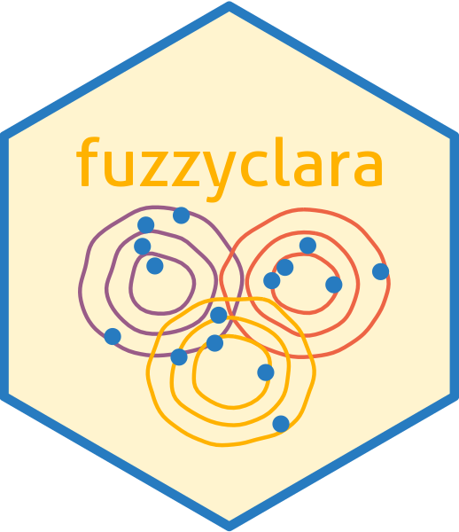

```{r options, echo=FALSE}
library(knitr)
opts_chunk$set(warning=FALSE)
```

# fuzzyclara 

<!-- badges: start
[](https://github.com/bauer-alex/APCtools/actions)
[](https://app.codecov.io/gh/bauer-alex/APCtools)
[](https://cran.r-project.org/package=fuzzyclara)
-->
[](https://opensource.org/licenses/MIT)
<!-- badges: end -->

Efficient and fuzzy clustering based on the CLARA algorithm

* Authors: [Maximilian Weigert](https://www.en.stablab.stat.uni-muenchen.de/people/doktoranden/weigert/index.html), [Alexander Bauer](https://github.com/bauer-alex/), Jana Gauss
* Contributors: Asmik Nalmpatian
* Version: 0.1


## Aim of this Package

Some general text

In contrast to other software packages, `fuzzyclara` ...


## Main Functionality

...

## Documentation and Useful Materials

To get an overview of the functionalities of the package, check out the
[package vignette](https://MaxWeigert.github.io/fuzzyclara/articles/main_functionality.html).

## Installation

The most current version from GitHub can be installed via
```{r, eval=FALSE}
devtools::install_github("MaxWeigert/fuzzyclara")
```


## How to Contribute

If you encounter problems with the package, find bugs or have suggestions for
additional functionalities please open a
[GitHub issue](https://github.com/MaxWeigert/fuzzyclara/issues).
Alternatively, feel free to contact us directly via email.

Contributions (via pull requests or otherwise) are welcome.
Before you open a pull request or share your updates with us, please make sure
that all unit tests pass without errors or warning messages. You can run the unit
tests by calling
```r
devtools::test()
```

## References

...
