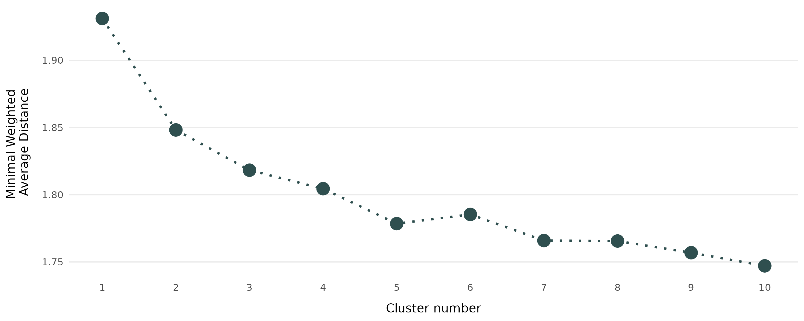

# Summary

Cluster analysis identifies groupings of observations that share similar
characteristics.
One popular approach are medoid-based methods where each cluster center is
represented by one *typical* observation [@kaufman_rousseeuw_2005].
The R package `fuzzyclara` makes a wide range of clustering algorithms conveniently available.
It covers classical *hard clustering* methods (where one observation belongs to exactly one cluster)
and alternative *fuzzy clustering* methods (where each observation
is shaped by its partial membership to different clusters), and further implements
the option to combine such algorithms with subsampling-based estimation techniques
to make the estimation on large data feasible.
The package additionally provides convenience functionalities and visualization
techniques to cover the whole workflow for real-world clustering applications.

# Statement of Need

Partitioning clustering algorithms aim to find reasonable groupings (*clusters*)
of a set of observations based on a predefined number of clusters.
Medoid-based versions of this strategy build clusters based on *medoids*,
i.e. one observation per cluster best representing its typical characteristics.
The most prominent representative of medoid-based clustering is the
*partitioning around medoids* (PAM) algorithm [@kaufman_rousseeuw_2005].

The PAM algorithm, however, has two drawbacks.
First, its estimation can become hardly feasible in data situations with thousands of observations,
scaling quadratically ($O(n^2)$) in terms of runtime and memory usage.
Sampling-based algorithms like CLARA [@kaufman_rousseew_1986] or
CLARANS [@ng_han_2002] allow for a more efficient estimation in such situations.
Second, PAM is a hard clustering algorithm where each observation is assigned to a single cluster.
This assumption is often not resembling reality when observations share
characteristics of several *typical* clusters.
Such structures are taken into account by *fuzzy clustering* methods, which
compute membership scores for each observation to every cluster.

The statistical software R already provides a wide range of packages implementing
clustering algorithms for large or fuzzy data.
The `cluster` package [@R_cluster] contains diverse clustering routines
developed by @kaufman_rousseeuw_2005 including the CLARA algorithm for large
data and the FANNY algorithm for fuzzy data.
The CLARANS algorithm as an extension of CLARA is implemented in the package
`qtcat` [@R_qtcat].
The package `fastkmedoids` [@R_fastkmedoids] provides computationally more efficient
versions of the CLARA and CLARANS algorithms.
A variety of medoid-based fuzzy clustering methods are further available in packages
`vegclust` [@R_vegclust] and `fclust` [@R_fclust].

All above implementations either allow for the application of fuzzy clustering
or of subsampling approaches, but not both simultaneously.
While the `fuzzyclara` package includes the option to perform hard clustering
using the classical PAM algorithm and to use all implemented algorithms with
any kind of (dis)similarity metric,
the package also allows for simultaneously analyzing large and
fuzzy data, by combining the CLARA / CLARANS algorithms with the
fuzzy-k-medoids algorithm by @krishnapuram_1999.
The package further provides routines to cover the whole workflow for
real-world clustering applications, including the use of user-defined distance functions.

# Combination of fuzzy and CLARA clustering
We combine the CLARA clustering algorithm of @kaufman_rousseew_1986 with the
principle of fuzzy clustering.
The original CLARA algorithm consists of the following steps,
given a predefined number of $J$ clusters:

1. Determination of $K$ random subsamples of the data \
2. For each subsample $k = 1,..., K$: \
   (a) Application of PAM clustering on the subsample. \
   (b) Assignment of each observation in the complete dataset to the cluster
   with the closest medoid. \
   (c) Computation of the average distance of each observation to its closest
   clustering medoid as clustering criterion $C_p$:
\begin{equation}
C_p = \frac{1}{n} \sum_{i=1}^n d_{ij_{min}p},
\end{equation}
where $d_{ijp}$ denotes the distance of observation $i$ to its closest medoid
(i.e. observation $j_{min}$) based on the clustering solution on subsample $k$.
3. Selection of the optimal set of clusters according to the minimal
clustering criterion.

We adapt this scheme to allow for fuzziness by applying the
fuzzy-k-medoids algorithm [@krishnapuram_1999] in step 2a.
Each observation of the complete dataset is then assigned a membership score
to all clusters $j$:
\begin{equation}
u_{ijp} = \frac{(\frac{1}{d_{ijp}})^{\frac{1}{m-1}}}{\sum_{j = 1}^J (\frac{1}{d_{ijp}})^{\frac{1}{m-1}}},
\end{equation}
where $m$ controls the degree of fuzziness.
The clustering criterion $C_p$ is accordingly defined as the weighted sum of all distances
to the medoids of all clusters, with weights according to the membership scores:
\begin{equation}
C_p = \frac{1}{n} \sum_{i=1}^n\sum_{k=1}^K u_{ijp}^m d_{ijp}.
\end{equation}
The optimal cluster solution is the subsample solution which
minimizes this average weighted distance.
Note that this simplifies to the hard clustering CLARA
algorithm when only allowing membership scores of 0 and 1.
The implementation of a fuzzy version of the more efficient CLARANS algorithm
(which iteratively evaluates random pairs of medoids and non-medoids) [@ng_han_2002]
follows the same scheme of adaptation.

`fuzzyclara` further covers the whole clustering workflow, allowing for the interpretation of clustering
solutions (e.g. with principal components plots), the analysis of silhouette scores
or the determination of the number of clusters.
<!--The fuzziness of a clustering solution can be visualized either based on the estimated membership scores
or by restricting on *core cluster observations* with some minimal membership score threshold.-->
<!--The optimal number of clusters may be determined by the function
`evaluate_cluster_numbers` which repeatedly performs the clustering with
different clusters based on the same random samples.-->

# Application
We demonstrate the functionality by clustering German tourists from the included `travel` dataset.
The data originates from an annual cross-sectional study on pleasure travel and comprises
11\,871 travelers between 2009 to 2018. Included variables cover the travel year,
the annual number of trips, the overall travel expenses and the maximum travel distance.

Due to the large data size of over 10\,000 observations, we apply the CLARA algorithm with 20
randomly drawn samples of size 1\,000. As tourists typically share
characteristics of several tourist types, we use the fuzzy version with a
membership exponent of $m = 1.5$. The elbow criterion (see \autoref{fig:elbow})
suggests the use of a five cluster solution.

\autoref{fig:parcoord} highlights the characteristics of the different clusters.
While clusters 1 and 3 show a tendency to trips of shorter length, lower
distance and lower costs, the tourists of cluster 4 tend to travel most
frequently and spend the most money for travelling. Less salient differences exist
between clusters 2 and 5.

# Acknowledgments

This work has been partially funded by the German Research Foundation (DFG)
under Grant No. KU 1359/4-1 and by the German Federal Ministry of Education and
Research (BMBF) under Grant No. 01IS18036A.

# References
