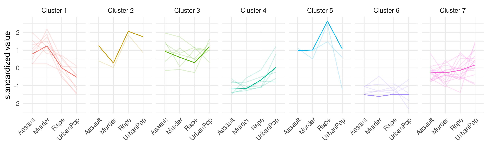

# Summary

Cluster analysis identifies optimal groupings of observations that share similar
characteristics.
One popular approach is to use medoid-based methods where each cluster center is
represented by one *typical* observation [@kaufman_rousseeuw_2009].
The R package `fuzzyclara` provides routines to cover the whole workflow for
real-world clustering applications.
Beyond general convenience functionalities and visualization techniques,
this comprises the estimation of hard and fuzzy clusterings and
the inclusion of subsampling-based estimation algorithms to make the
estimation on large data feasible.

# Statement of Need

Partitioning clustering algorithms aim to find reasonable groupings (*clusters*)
of a set of observations based on a predefined number of cluster.
Medoid-based versions of this strategy build clusters based on *medoids*,
one observation per cluster best representing its typical characteristics.
The most prominent representative of medoid-based clustering is the
*partitioning around medoids* (PAM) algorithm, which is considered
a robust method for many data situations [@kaufman_rousseeuw_2009].

The PAM algorithm, however, suffers from two drawbacks.
First, the estimation is often only hardly or not at all feasible in large data
situations with thousands of observations.
The algorithm requires the computation of a (dis)similarity matrix between all
observations which scales quadratically ($O(n^2)$) in terms of runtime and
memory usage.
Sampling-based algorithms such as CLARA
(TODO Kaufman Rousseeuw 1986, so zitiert wie in deren 2009'er Buch) or
CLARANS [@ng_han_2002] make the estimation feasible in such situations.
Second, PAM is a hard clustering algorithm where each observation is rigidly
assigned to a single cluster.
This assumption is not best resembling reality in many data situations where
observations may share characteristics of several *typical* clusters.
Such structures are taken into account by *fuzzy clustering* methods which
compute membership scores for each observation to each cluster.

The statistical software R already provides a wide range of packages containing
clustering algorithms for large or fuzzy data.
The package `cluster` [@R_cluster] contains diverse clustering routines
developed by @kaufman_rousseeuw_2009 including the CLARA algorithm for large
data and the FANNY algorithm for fuzzy data.
The CLARANS algorithm as an extension of CLARA is implemented in the package
`qtcat` [@R_qtcat].
The package `fastkmedoids` [@R_fastkmedoids] provides fast CLARA and
CLARANS algorithms (TODO konkreter schreiben was 'fast CLARA' bedeutet).
A variety of medoid-based fuzzy clustering methods is available in packages
`vegclust` [@R_vegclust] and `fclust` [@R_fclust] (TODO konkreter schreiben wie sich diese fuzzy-Methoden zu FANNY verhaelt).  
TODO Sind das alle Pakete?  
TODO Welche anderen Pakete beschaeftigen sich mit dem kompletten Workflow von Clustering?

All of the above implementations have in common that they either alllow for the
application of fuzzy clustering or of subsampling approaches, but not both
simultaneously.
The 'fuzzyclara' package makes it possible to simultaneously analyze large and
fuzzy data, by combining the CLARA and CLARANS algorithms with the
fuzzy-k-medoids algorithm by Krishnapuram [@krishnapuram_1999].
Beyond this, the package provides routines to cover the whole workflow for
real-world clustering applications including the choice of the optimal number of
clusters, the use of user-defined distance functions and diverse visualization
techniques.

# Combination of fuzzy and CLARA clustering
To combine the CLARA strategy with the principle of fuzzy clustering,
we adapt the original CLARA clustering algorithm.
% which was originally designed as a efficient variant of the partitioning around medoids (PAM) algorithm.
The CLARA algorithm by Kaufmann and Rousseauw (REFERENCE) consists of the
following steps:

1. Determination of $k$ random subsamples of the data \
2. For each subsample: \
a Application of PAM clustering on each subsample \
b Assignment of each observation of the whole dataset \
c Computation of the average distance to the closest clustering medoid as
clustering criterion:
3. Selection of the best clustering solution according to the minimal
clustering criterion

To account for fuzzyness, we adapt this algorithm as follows. Instead of a hard
clustering method, we apply the fuzzy-k-medoids algorithm [@krishnapuram_1999]
on each subsample of the data in step 2. Afterwards, each observation is
assigned a membership score to each cluster according to the fuzzy-k-medoids
algorithm:
\begin{equation}
u_{ij} = \frac{1}{\sum} 
\end{equation}
As clustering criterion a weighted average distance taking into
account all membership scores. Finally, the final clustering solution is
determined by the subsample solution which minimizes the average weighted
distance. 

The CLARANS algorithm does not use random samples of the data, but... The
implementation of its fuzzy version follows basically the same idea as the
fuzzy CLARA agorithm. Again, memberships scores are computed according to (1)
and the weighted average distance to the cluster medoid is uses as selection
criterion. 

# General Routine of Cluster Analysis

Wir haben auch hard clustering, verschiedene Visualisierungen, Clusteranzahl, alle Distanzfunktionen

# Application
To showcase the functionality of our clustering package, we apply `fuzzyclara`
clustering to the USArrests [@mcneil_1977] data available in clustering.
Grpahik 1: Optimale Clusteranzahl
Graphik 2: Wordcloud, PCA-Plot (differenziert nach Kerncluster)

# Acknowledgments

This work has been partially funded by the German Research Foundation (DFG) under Grant No. KU 1359/4-1 and by the German Federal Ministry of Education and Research (BMBF) under Grant No. 01IS18036A.

# References
