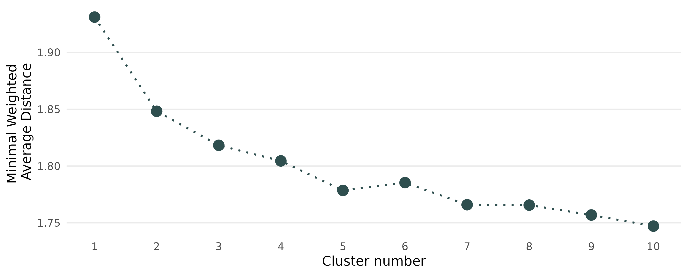

# Summary

Cluster analysis identifies optimal groupings of observations that share similar
characteristics.
One popular approach is to use medoid-based methods where each cluster center is
represented by one *typical* observation [@kaufman_rousseeuw_2009].
The R package `fuzzyclara` makes a wide range of clustering algorithms conveniently available.
It not only covers classical *hard clustering* methods (where one observation belongs to exactly one cluster)
and alternative *fuzzy clustering* methods (where the characteristics of each observation
are shaped by its partial membership to different clusters), but specifically also implements
the option to combine such algorithms with subsampling-based estimation techniques to make the
estimation on large data feasible.
The package additionally provides convenience functionalities and visualization
techniques to cover the whole workflow for real-world clustering applications.

# Statement of Need

Partitioning clustering algorithms aim to find reasonable groupings (*clusters*)
of a set of observations based on a predefined number of clusters.
Medoid-based versions of this strategy build clusters based on *medoids*,
i.e. one observation per cluster best representing its typical characteristics.
The most prominent representative of medoid-based clustering is the
*partitioning around medoids* (PAM) algorithm, which is robust and applicable to
many data situations [@kaufman_rousseeuw_2009].

The PAM algorithm, however, has two drawbacks.
First, its estimation is often only hardly or not at all feasible in large data
situations with thousands of observations.
The algorithm requires the computation of a (dis)similarity matrix between all
observations, scaling quadratically ($O(n^2)$) in terms of runtime and
memory usage.
Sampling-based algorithms such as CLARA [@kaufman_rousseew_1986] or
CLARANS [@ng_han_2002] make the estimation feasible in such situations.
Second, PAM is a hard clustering algorithm where each observation is rigidly
assigned to a single cluster.
This assumption is not best resembling reality in many data situations where
observations may share characteristics of several *typical* clusters.
Such structures are taken into account by *fuzzy clustering* methods which
compute membership scores for each observation to every cluster.

The statistical software R already provides a wide range of packages implementing
clustering algorithms for large or fuzzy data.
The package `cluster` [@R_cluster] contains diverse clustering routines
developed by @kaufman_rousseeuw_2009 including the CLARA algorithm for large
data and the FANNY algorithm for fuzzy data.
The CLARANS algorithm as an extension of CLARA is implemented in the package
`qtcat` [@R_qtcat].
The package `fastkmedoids` [@R_fastkmedoids] provides computationally more efficient
versions of the CLARA and CLARANS algorithms.
A variety of medoid-based fuzzy clustering methods are further available in packages
`vegclust` [@R_vegclust] and `fclust` [@R_fclust].

All of the above implementations have in common that they either allow for the
application of fuzzy clustering or of subsampling approaches, but not both
simultaneously.
While the `fuzzyclara` package includes the option to perform hard clustering
using the classical PAM algorithm and to use all implemented algorithms with
any kind of (dis)similarity metric,
(which are used by `proxy::dist`) or use a self-defined metric.--> 
the package also allows for simultaneously analyzing large and
fuzzy data, by combining the CLARA / CLARANS algorithms with the
fuzzy-k-medoids algorithm by @krishnapuram_1999.
Beyond this, the package provides routines to cover the whole workflow for
real-world clustering applications, including the use of user-defined distance functions,
the choice of the optimal number of clusters and diverse visualization
techniques.

# Combination of fuzzy and CLARA clustering
To combine the CLARA strategy with the principle of fuzzy clustering,
we utilize the original CLARA clustering algorithm by @kaufman_rousseew_1986. The
algorithm consists of the following steps, given a predefined number of $J$
clusters:

1. Determination of $K$ random subsamples of the data \
2. For each subsample $k = 1,..., K$: \
   (a) Application of PAM clustering on the subsample. \
   (b) Assignment of each observation in the complete dataset to the cluster
   with the closest medoid. \
   (c) Computation of the average distance of each observation to its closest
   clustering medoid as clustering criterion $C_p$:
\begin{equation}
C_p = \frac{1}{n} \sum_{i=1}^n d_{ij_{min}p},
\end{equation}
where $d_{ijp}$ denotes the distance of observation $i$ to its closest medoid
(i.e. observation $j_{min}$) based on the clustering solution on subsample $k$.
3. Selection of the optimal set of clusters according to the minimal
clustering criterion.

We further allow for fuzziness in the algorithm by adapting it as follows.
Instead of a hard clustering method, we apply the fuzzy-k-medoids algorithm
[@krishnapuram_1999] on each subsample of the data in step 2a.
Each observation of the complete dataset is assigned a membership score
to all clusters $j$ according to the fuzzy-k-medoids algorithm:
\begin{equation}
u_{ijp} = \frac{(\frac{1}{d_{ijp}})^{\frac{1}{m-1}}}{\sum_{j = 1}^J (\frac{1}{d_{ijp}})^{\frac{1}{m-1}}},
\end{equation}
where $m$ denotes the fuzziness exponent controlling the degree of fuzziness.
The clustering criterion $C_p$ is accordingly defined as the weighted sum of all distances
to the medoids of all clusters, with weights according to the membership scores:
\begin{equation}
C_p = \frac{1}{n} \sum_{i=1}^n\sum_{k=1}^K u_{ijp}^m d_{ijp}.
\end{equation}
The optimal cluster solution is the subsample solution which
minimizes this average weighted distance.
Note that this adapted CLARA algorithm simplifies to the original, hard clustering CLARA
algorithm, when only allowing membership scores of 0 and 1.

As an alternative, and in contrast to the CLARA algorithm, the CLARANS algorithm does not evaluate a
set of random samples, but random pairs of medoids and non-medoids, to iteratively
check for a potential improvement of the current clustering solution [@ng_han_2002].
The implementation of its fuzzy version follows
the same scheme as the fuzzy CLARA algorithm with the computation of membership
scores according to (2) and the selection of the best clustering solution over
all local clusterings based on the minimal weighted average distance.

# General Routine of Cluster Analysis

Beyond the efficient estimation of (fuzzy) clustering through subsampling approaches,
`fuzzyclara` comprises functionalities that cover the whole clustering workflow.
The package implements a range of routines for (visually) evaluating the clustering
solutions, including principal components plots, the analysis of silhouette scores
or the determination of the number of clusters.
Using the implemented visualizations, the fuzziness of a clustering solution can either be visualized
based on the estimated membership scores
or by restricting on *core cluster observations* with some minimal membership score threshold.
<!--The optimal number of clusters may be determined by the function
`evaluate_cluster_numbers` which repeatedly performs the clustering with
different clusters based on the same random samples.-->

# Application
We demonstrate the functionality of the `fuzzyclara` package by clustering
German tourists based on the included `travel` data. The data originates from an
annual cross-sectional study on pleasure travel and contains information on
11\,871 travelers between 2009 to 2018. Apart from the travel year, included variables
are the number of trips made within a year, the overall amount of travel
expenses and the maximum travel distance.

Due to the rather large data size of over 10\,000 observations, we apply the CLARA algorithm with 20
randomly drawn samples of size 1\,000. As tourists are likely to share
characteristics of several tourist types, we use the fuzzy version with a
membership exponent of $m = 1.5$. Based on the minimum average weighted
dissimilarity, the elbow criterion (see \autoref{fig:elbow})
suggests the use of the solution with five different clusters.

\autoref{fig:parcoord} highlights the characteristics of the different clusters by
visualizing the individual paths of 500 randomly sampled observations plus the
medoid. While cluster 1 shows a tendency to trips of shorter length, lower
distance and lower costs, the tourists of cluster 2 tend to travel most
frequently and spend the most money for travelling. Between the clusters 3 and
4, there are only minor differences regarding travel distances and expenses.

# Acknowledgments

This work has been partially funded by the German Research Foundation (DFG)
under Grant No. KU 1359/4-1 and by the German Federal Ministry of Education and
Research (BMBF) under Grant No. 01IS18036A.

# References
